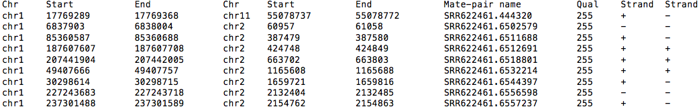
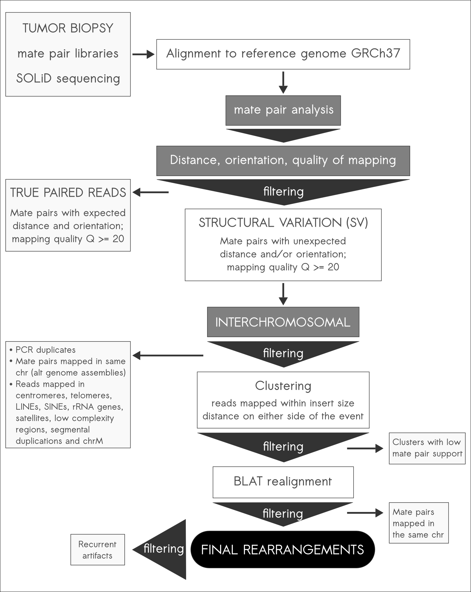
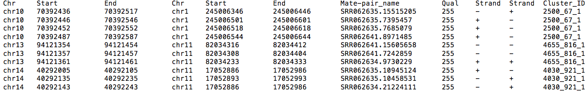
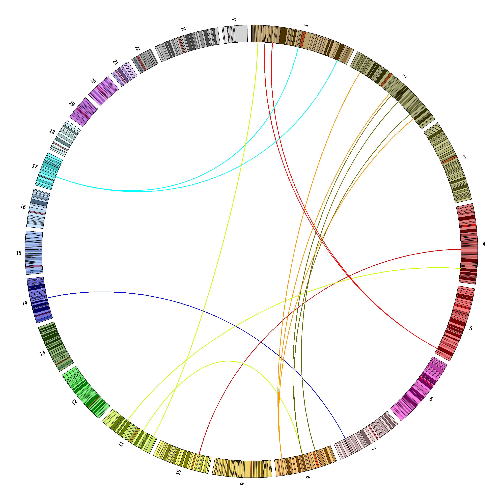
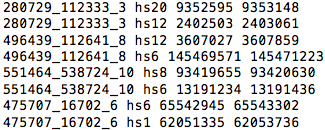

.. ICRMax documentation master file, created by
   sphinx-quickstart on Tue Sep  9 09:39:08 2014.
   You can adapt this file completely to your liking, but it should at least
   contain the root `toctree` directive.

ICRmax
==================================

..
    .. Contents::

.. toctree::
   :maxdepth: 2
   what

.. Indices and tables
.. ==================

.. * :ref:`genindex`
.. * :ref:`modindex`
.. * :ref:`search`

What is ICRmax?
==================================
ICRmax is a computational pipeline designed for the cost-effective identification of a minimal set of tumor-specific interchromosomal rearrangements (ICRs) for clinical application. 

How ICRmax works
==================================
ICRmax was developed with a set of strict filters to eliminate false positive ICR events. The pipeline is able to remove most cases of non-somatic events without the need for sequencing the matched normal genome for each sample.

Benefits
==================================
The cost reduction resulting from this approach creates an opportunity to implement this analysis in the clinical setting, mainly for detection of personalized biomarkers that can be used in the management of solid tumors.

Requirements
==================================
All the steps necessary for the ICRmax pipeline can be performed using open-source software/pipelines and publicly available data.

**Software and pipelines:**

* A computer running Linux (suggested distributions: Ubuntu, Fedora or CentOS. ICRMax should work on all Linux distributions).
* BLAT (how to install: http://users.soe.ucsc.edu/~kent/src/)
* Bedtools (how to install: http://bedtools.readthedocs.org/en/latest/)

**Data:**

* Alternative genome assemblies (see Preparing the WGS reads).
* Recurrent artifacts (download here `recurrent_artifacts.bed`_ or `recurrent_1000G.bed`_).
* Repetitive regions to filter (download here `centr_and_tel.bed`_ and `all_to_mask.bed`_)
* Whole genome sequence alignment data in BAM or BED format (see below for details).

.. _recurrent_artifacts.bed: http://www.bioinfo.mochsl.org.br/icrmax/recurrent_artifacts.bed
.. _recurrent_1000G.bed: http://www.bioinfo.mochsl.org.br/icrmax/recurrent_1000G.bed
.. _centr_and_tel.bed: http://www.bioinfo.mochsl.org.br/icrmax/centr_and_tel.bed
.. _all_to_mask.bed: http://www.bioinfo.mochsl.org.br/icrmax/all_to_mask.bed

To transform paired bam files into bedpe use: ::

  $ bedtools bamtobed –bedpe <input.bam>

Example bedpe file:

Overview 
==================================
To run ICRmax simply follow the **Step-by-step command line** summarized in the figure below:

Preparing the WGS reads
==================================
Mate-pair (usually from SOLiD platform) or paired-end (usually from Illumina platform) reads resulting from whole genome sequencing must be aligned to the reference genome. Users are free to choose the best mapping algorithm for their platform. Suggestions are NovoAlignCS or BioScope for SOLiD mate-pair reads and BWA or Bowtie2 for Illumina paired-end reads.

Alignment to alternative reference assemblies is also advised since differences in assembly can give rise to mate-pair reads mapped in different chromosomes according to one assembly but not another. The alternative assemblies that can be used for mapping are:

**HuRef** (J. Craig Venter Institute) [Levy et. al 2007]

**GRCh37_alt** (Partial reference genome with alternative representations – Genome Reference Consortium)
    
**CRA** (Human chr7 complete sequence – The Center for Applied Genomics) [Scherer et al. 2003]

Note: For the alternative assemblies, use as input only the reads belonging to mate-pairs that mapped in different chromosomes in the initial reference genome alignment. There is no need to realign the reads that have reliable mappings to the same chromosome.

Step-by-step command line
==================================
At this step you should have a paired BED file (bedpe) containing the aligned mate-pair or paired-end reads mapped in different chromosomes with mapping quality greater than or equal to 20, after the reference genome mapping and mapping to alternative reference assemblies. The duplicate reads should also have been removed. For that, samtools rmdup is a good option (see http://www.htslib.org/man/samtools)

  **1.** Remove reads mapped in the mitochondrial chromosome and order the bed file: ::

    $ grep -v 'chrM' input.bed | sortBed > step1_woM.bed

  **2.** Remove reads mapped in centromere and telomere regions. To do that on both reads in the mate pair you must invert the file and repeat the command. 

  Download the file with centromere end telomere positions `centr_and_tel.bed`_: ::

    $ bedtools subtract -A -a step1_woM.bed -b centr_and_tel.bed > step2.wo_centr_tel.bed
    $ awk '{print $4,$5,$6,$1,$2,$3,$7,$8,$10,$9}' step2.wo_centr_tel.bed | sed "s/\s/\t/g" | sortBed > step2.wo_centr_tel.inv.bed
    $ bedtools subtract -A -a step2.wo_centr_tel.inv.bed -b centr_and_tel.bed > step2.wo_centr_tel.final.bed

  **3.** Remove reads mapped in masked regions. Download the file with regions to mask all_to_mask.bed: ::

    $ bedtools subtract -A -f 1.0 -a step2.wo_centr_tel.final.bed -b all_to_mask.bed > step3.masked.bed
    $ awk '{print $4,$5,$6,$1,$2,$3,$7,$8,$10,$9}' step3.masked.bed | sed "s/\s/\t/g" | sortBed > step3.masked.inv.bed
    $ bedtools subtract -A -f 1.0 -a step3.masked.inv.bed -b all_to_mask.bed | sortBed > step3.masked.final.bed

  **4.** Cluster the reads from different mate pairs mapped in the same chromosome. Use mean insert size +2s.d. as cluster distance (-d size, e.g. 1000). At this point observe that a cluster number will be generated and the file will have an extra column ($11): ::

    $ bedtools cluster -i step3.masked.final.bed -d 1000 > step4.cluster.bed
    $ awk '{print $4,$5,$6,$1,$2,$3,$7,$8,$10,$9,$11}' step4.cluster.bed | sed "s/\s/\t/g" | sortBed > step4.cluster.inv.bed
    $ bedtools cluster -i step4.cluster.inv.bed -d 1000 > step4.cluster.final.bed

  **5.** Join cluster numbers generated for both sides and select only clusters with 3 or more reads: ::

    $ sed -i "s/\t/_/11" step4.cluster.final.bed
    $ awk '{print $11}' step4.cluster.final.bed | nsort | uniq -c | awk '{if ($1>=3) print $2}' > clusters_over_3_reads
    $ fgrep -w -f clusters_over_3_reads step4.cluster.final.bed > step5_cutoff3.bed

  **6.** For SOLiD platform we suggest realigning the reads with BLAT using as input the sequences resulting from the initial alignment, BLAT parameters are the same used as default in the webtool: ::

    $ blat -stepSize=5 -repMatch=2253 -minScore=24 -minIdentity=80 -noTrimA -fine -out=pslx genome.2bit input.fa

  Parse BLAT results and remove reads mapped in the same chromosome after alignment.

  **7.** Invert the read order in the BED file once again and recluster the reads once more, this step should remove any clusters containing large gaps from reads that were removed by the BLAT filter. After that select only clusters still represented by at least 3 reads, at this point there are three numbers in the cluster id: ::

    $ awk '{print $4,$5,$6,$1,$2,$3,$7,$8,$10,$9,$11}' step6_BLAT_filter.bed | sed "s/\s/\t/g" | sortBed | bedtools cluster -d 1000 > step7_recluster.bed
    $sed -i "s/\t/_/11" step7_recluster.bed
    $awk '{print $11}' step7_recluster.bed | nsort | uniq -c | awk '{if ($1>=3) print $2}' > clusters_over_3_reads
    $fgrep -w -f clusters_over_3_reads3 step7_recluster.bed > step7_recluster_cutoff3.bed

Initial ICRmax output
==================================
Example initial output:

Cluster ids should have 3 numbers (eg: 14774_4005_1). Each cluster id groups reads mapping around one ICR breakpoint.

Removing recurrent events
==================================
The final clusters of mate-pair reads can be merged at this stage so that each event has two coordinates, one in each chromosome.

The command below will separate the read coordinates (one line for each chromosome) and with the simple perl script the overlapping reads will be joined into a single coordinate for each chromosome.

Download here `merge_bed_reads.pl`_ ::

  $ awk '{print $1"\t"$2"\t"$3"\t"$11"\n"$4"\t"$5"\t"$6"\t"$11}' step7_recluster_cutoff3.bed > reads_in_final_clusters.bed
  $ perl merge_bed_reads.pl reads_in_final_clusters.bed > merged.bed

The merged.bed file can then be used to check for recurrent artifacts and remove them. With bedtools intersect you can compare both your file and the recurrent artifact list, and with the subsequent awk commands you select only the events with both chromosome positions equal to a single other event in the artifact list. The output contains only the ids for the events you should remove from your final list.

As a list of recurrent rearrangements you can use either one of the downloaded files (or both):

`recurrent_artifacts.bed`_ (list of recurrent artifacts found in our tumor samples)

`recurrent_1000G.bed`_ (list of recurrent artifacts found in 3 or more 1000G individuals) ::

    $ bedtools intersect –wo –a merged.bed –b recurrent_artifacts.bed | awk ‘{print $1,$4,$8}’ | sort | uniq | awk ‘{print $2,$3}’ | sort | uniq –d | awk ‘{print $1}’ | sort | uniq > recurrent_merged.bed
    $ fgrep –w –v –f recurrent_merged.bed merged.bed > merged_final.bed

.. _merge_bed_reads.pl: http://www.bioinfo.mochsl.org.br/icrmax/merge_bed_reads.pl

Detecting new recurrent events in your samples
==================================
Comparison between rearrangements from different samples can be easily done with the bedtools merge command as used above, make sure to allow for a distance similar to the clustering distance used (-d 1000) outside of the read span and alter the cluster names to include sample identification (ex: 14774_4005_1_RT2). This way, after the bedtools merge command using the parameters –nms you should have a single cluster and the different cluster names separated by a semicolon. ::

  $ sortBed all_sample_rearrangements.bed | bedtools merge –d 1000 –nms > merged_samples.bed

To process this file a simple perl script is used (download here `find_recurrent.pl`_) ::

  $ perl find_recurrent.pl merged_samples.bed > tmp_file
  $ awk –F “\t” ‘{print $3}’ tmp_file | sort | uniq –c | awk ‘{if ($1>=2) print $2}’ > recurrent_in_two_or_more_samples
  $ fgrep –w –v –f recurrent_in_two_or_more_samples tmp_file | awk ‘{print $1}’ > final_non_recurrent_list

.. _find_recurrent.pl: http://www.bioinfo.mochsl.org.br/icrmax/find_recurrent.pl

Visualizing output in Circos plots
==================================
Circos representation (http://circos.ca) is a common way to visualize structural variations detected in a genome. Here we provide the configuration files necessary for generating a Circos plot similar to the one illustrated below with your data.

To install Circos see http://circos.ca/software/download/circos

Download `here`_ the configuration files

To run circos your input file name should be input_inter.txt or changed in the links.conf file

Input format example:

To convert a bed file (final merged version) to the circos input file: ::

  $ awk –F “\t” ‘{print $4,$1,$2,$3}’ merged.bed | sed “s/chr/hs/;s/X/x/;s/Y/y/” > input_inter.txt

Circos plot command: ::

  $ circus –conf circos.conf

.. _here: http://www.bioinfo.mochsl.org.br/icrmax/circos_conf.tar.bz2

Updates
==================================
We intend to release updates for our recurrent artifact list as we analyze more mate-pair WGS samples (both tumor and normal). 

We also encourage users to submit new recurrent artifacts with the appropriate read support to improve this resource. Get in touch with our group (see **Contact**).

Data Access
==================================
The WGS data for samples used in our analyses were deposited in the European Nucleotide Archive (ENA; http://www.ebi.ac.uk/ena) under accession number PRJEB4781.

WGS data from the 1000 Genomes project was accessed through the Open Science Data Cloud (http://www.opensciencedatacloud.org). 

Acknowledgements
==================================
Daniel T. Ohara

Contact
==================================
Elisa Donnard, edonnard at mochsl.org.br

Pedro Galante, pgalante at mochsl.org.br

References
==================================
ICRmax: an optimized approach to detect tumor-specific InterChromosomal Rearrangements for Clinical Application

Donnard ER, Carpinetti P, Navarro FCP, Perez RO, Habr-Gama A, Parmigiani RB, Camargo AA and Galante PAF

[under review]

Structural Variations in Rectal Cancer as Biomarkers for Detecting Residual Disease after Neoadjuvant Treatment

Carpinetti P*, Donnard ER*, Perez RO, Habr-Gama A, Parmigiani RB, Galante PAF and Camargo AA 

[manuscript in preparation]
